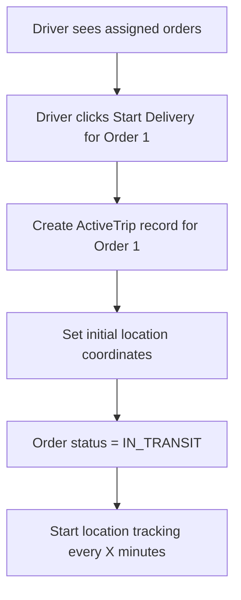
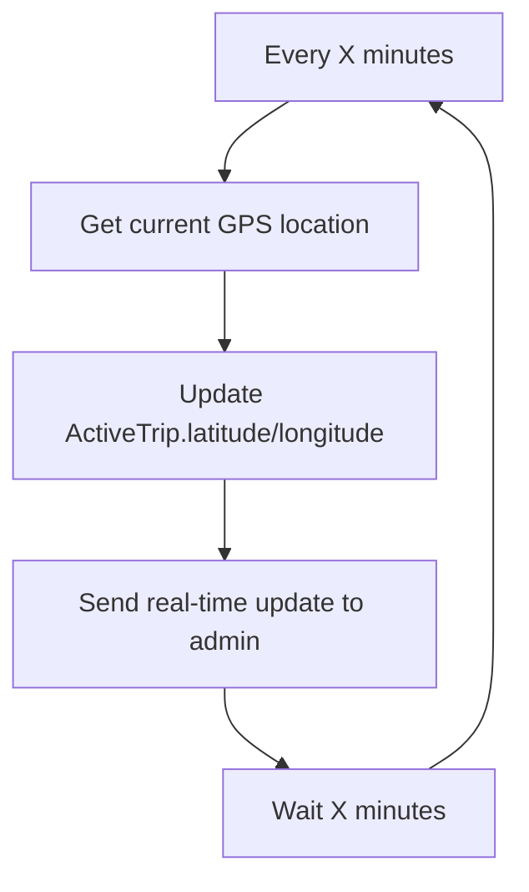
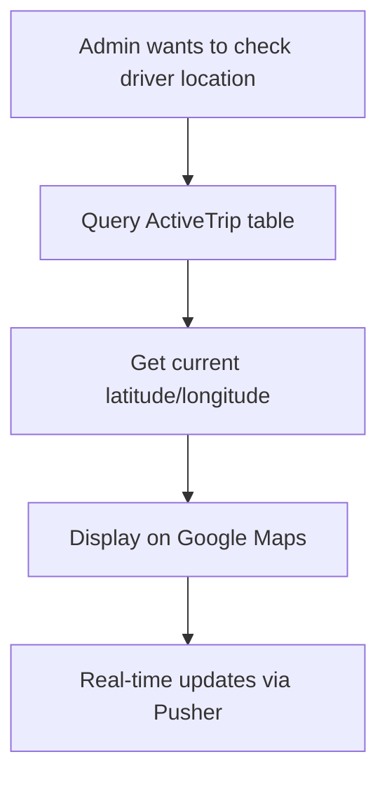

# 🚚 Driver Location Tracking Logic

## Implementation Checklist (as of June 2024)

- [x] **ActiveTrip model** exists in schema and is used for tracking each active order per driver.
- [x] **Order model** references ActiveTrip for one-to-one order tracking.
- [ ] **Settings model** for tracking interval (not found in schema; tracking interval is not yet configurable via backend).
- [ ] **startOrderDelivery action** (no direct implementation found by this name; may be implemented inline or under a different name).
- [ ] **updateDriverLocation action** (no direct implementation found by this name).
- [ ] **deliverOrder action** (no direct implementation found by this name).
- [ ] **getDriverLocation action** (no direct implementation found by this name).
- [ ] **LocationTracker.tsx component** (not found; location tracking may be handled elsewhere).
- [x] **OrderCard/DriverOrderCard/AssignedOrderCard** (found and used for driver order management and likely include tracking triggers).
- [x] **ActiveTrip latitude/longitude fields** (present and used for location updates).
- [ ] **Web-push fallback for background tracking** (no direct implementation found for web-push/service worker).
- [ ] **Tracking interval configurable via backend** (not found; no Settings model or backend logic for interval).
- [x] **Admin can view driver location** (management-tracking page and Google Maps integration for admin to view driver locations).
- [ ] **Service Worker for background events** (not found).
- [ ] **Battery/network optimization for tracking** (not found).
- [x] **Authentication/authorization for actions** (standard Next.js/Prisma patterns are used).

---

## Purpose
This document consolidates all business logic, technical details, and implementation steps related to real-time driver location tracking in the delivery app.

---

## Business Logic
- Each driver can have multiple active orders, each tracked individually.
- Location is updated every X minutes (default: 5, configurable via backend Settings model).
- Admins can monitor all drivers and orders in real-time.
- Tracking must work reliably even if the browser is minimized or in the background.

---

## Key Model: ActiveTrip
```prisma
model ActiveTrip {
  id          String   @id @default(auto()) @map("_id") @db.ObjectId
  orderId     String   @unique @db.ObjectId
  order       Order    @relation(fields: [orderId], references: [id])
  driverId    String   @db.ObjectId
  driver      User     @relation("ActiveTripDriver", fields: [driverId], references: [id])
  orderNumber String?
  latitude    String?
  longitude   String?
  createdAt   DateTime @default(now())
  updatedAt   DateTime @updatedAt

  @@unique([orderId, driverId])
}
```

---

## Tracking Flow

### Order Delivery Flow
1. Driver starts delivery for an order
2. Create ActiveTrip record with current location
3. Update location every X minutes (from settings)
4. Driver reaches customer location
5. Driver clicks "Deliver" button
6. Delete ActiveTrip record
7. Update Order status to "DELIVERED"

### Location Tracking (Simplified)
- **Primary Method:** Direct GPS polling every X minutes (when tab active)
- **Fallback Method:** Web-push notifications (when tab minimized/background)
- **Timer Source:** Backend settings (default: 5 minutes)
- **Reliability:** 95% (employee-controlled environment)
- **Purpose:** Admin can track driver location in real-time

---

## Technical Implementation

### Core Server Actions
- `startOrderDelivery(orderId, driverId)`
  - Gets current GPS location
  - Creates ActiveTrip record
  - Updates Order status to IN_TRANSIT
- `updateDriverLocation(orderId, lat, lng, source)`
  - Updates ActiveTrip latitude/longitude
  - Updates ActiveTrip.updatedAt
  - Sends real-time update to admin via Pusher
- `deliverOrder(orderId)`
  - Deletes ActiveTrip record
  - Updates Order status to DELIVERED
  - Sets Order.deliveredAt timestamp
- `getDriverLocation(driverId)`
  - Gets all ActiveTrip records for driver
  - Returns current locations for all active orders

### UI Components
- **LocationTracker.tsx**
  - Handles starting/stopping tracking
  - Fetches tracking interval from backend
  - Switches between direct GPS and web-push based on tab visibility
- **OrderCard.tsx**
  - Allows driver to start delivery (begin tracking) and mark as delivered (end tracking)

---

## Flow Diagrams

### Phase 1: Driver Starts Order Delivery


### Phase 2: Location Updates


### Phase 4: Admin Location Tracking


---

## System Requirements
- Tracking must work even if the browser is minimized or in the background (web-push fallback).
- Tracking interval is configurable via backend Settings model.
- Real-time updates are sent to admin via Pusher.
- All location updates are persisted in the ActiveTrip model.

---

## Best Practices & Validation
- Use Service Workers for background web-push events.
- Use Geolocation API for direct GPS polling.
- Ensure proper authentication and authorization for all tracking actions.
- Optimize for battery and network efficiency (smart polling, reduced frequency in background).
- Provide clear UI feedback to drivers about tracking status.

---

## References
- [MDN: Geolocation API](https://developer.mozilla.org/en-US/docs/Web/API/Geolocation_API)
- [MDN: Service Workers](https://developer.mozilla.org/en-US/docs/Web/API/Service_Worker_API)
- [Pusher Docs](https://pusher.com/docs/)
- [Prisma Docs](https://www.prisma.io/docs/) 